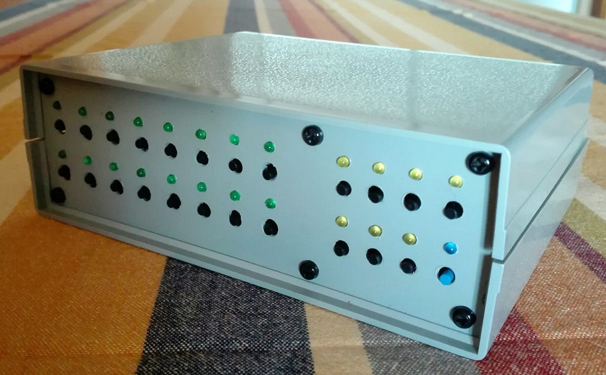
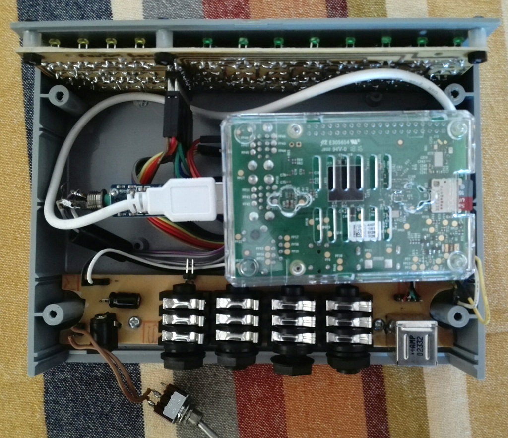

# MusicalBOX *"Mercury"* release
This is an open-source, home didactic project, for a *cheap magic musical box* that help me to play on-stage with my [band](https://www.facebook.com/groups/nurserycrymeband).  
Basically is an audio samples player based on RaspberryPi, derived from the original project of [Joseph Ernest's SamplerBox](https://github.com/josephernest/SamplerBox/).

Audio samples (presets) are selected one-by-one by a 2x8 switch-matrix, allowing up to 16 selectable presets.
Selected preset can be routed to one of two output lines (usefull when different sounds must go through different effect lines).

## Features
- All the features of the original SamplerBox
- Up to 16 selectable presets (from the samples wav files stored on the RaspberryPI microSD)
- Two output lines, connected to the Left and Right AudioDAC of the RaspberriPI (preset audio is software routed to the only-Left (Out-1) or only-Right (Out-2) output line by switch selection
- Permanent saving of preset+routing configurations (programs)

## Changes
See file [CHANGES](CHANGES.md) for the project resources change logs

## About
Author : Alessandro Fraschetti (mail: [gos95@gommagomma.net](mailto:gos95@gommagomma.net))

## License
This project is licensed under the [Creative Commons BY-SA 3.0](http://creativecommons.org/licenses/by-sa/3.0/) License

## Credits
Many thanks to Joseph Ernest for his original [SamplerBox](https://github.com/josephernest/SamplerBox/) project